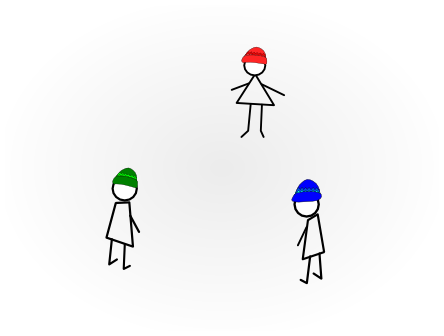

# Deep Reinforcement Learning for Partially Observable Multi-Agent problems

The source code for the Bachelor degree in Computer Science.

We apply Deep Reinforcement Learning techniques to solve popular riddles,
in which team work is highly needed. The agents need to learn how to cooperate 
in order to improve their results.  

## Analyzed riddles
We bring into discussion the [_Hats riddle_](https://github.com/StefanCobeli/Deep-Reinforcement-Learning-for-Partially-Observable-Multi-Agent-problems/blob/master/hats_riddle_keras.ipynb), 
the [_Switch riddle_](https://github.com/StefanCobeli/Deep-Reinforcement-Learning-for-Partially-Observable-Multi-Agent-problems/blob/master/switch_riddle_keras.ipynb)
and the [_Hats* problem_](https://github.com/StefanCobeli/Deep-Reinforcement-Learning-for-Partially-Observable-Multi-Agent-problems/blob/master/hat_problem_sumary.ipynb).

### Supplementary material
The folder [results](https://github.com/StefanCobeli/Deep-Reinforcement-Learning-for-Partially-Observable-Multi-Agent-problems/tree/master/results) contains plots, statistics and keras models obtained from this project.  

The folder [other attepmts](https://github.com/StefanCobeli/Deep-Reinforcement-Learning-for-Partially-Observable-Multi-Agent-problems/tree/master/other%20attempts) contains some unsuccessful experients.

## Hats*-problem

In the Jail of Riddles there is a tradition. On each Christmas Eve the prison chief must 
free ten 
good prisoners if they are able to solve a group task in order to show that they can integrate back in the 
society.
	
This year, the chief proposes the following problem.  The jailer has hats of ten different colors. He 
shows 
all the hat types to the prisoners. On each prisoner's head will be placed a hat of a random color 
selected from the ten colors showed earlier. The captives are placed in a circle. Thus, each prisoner can see 
the colors of the hats on the other nine heads.
	
Each prisoner must guess the color of its own hat and write it on a piece of paper. If at least one 
of them  guesses correctly, all of them will be released. If not, all will go back to their cells.

They are 
not allowed to say  anything or communicate in any other way with each other during the trial. However, they 
receive a prior one hour brake to plan together a strategy, which will prove that they are not only wise, but 
perfect teammates, also.

